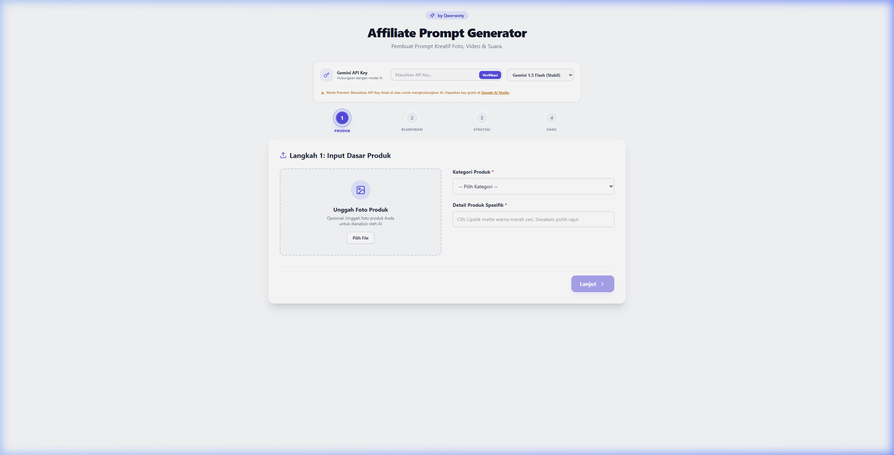

# Affiliate Prompt Generator 🚀

> **A powerful, production-grade AI-powered marketing storyboard creator that generates high-fidelity prompts for images, videos, and voiceovers using Google's official Gemini AI API.**

[](https://react.dev/)
[](https://www.typescriptlang.org/)
[](https://vitejs.dev/)
[](https://tailwindcss.com/)
[](LICENSE)

Designed specifically for affiliate marketers, content creators, and social commerce sellers, **Affiliate Prompt Generator** transforms a simple product description and an optional photo into a cohesive, structured 5-scene campaign. In seconds, you get production-ready creative prompts for Midjourney, DALL-E, Sora, Runway, Kling, and voiceover scripts ready for ElevenLabs or TikTok voice synthesis.

---

## 📸 Interface Preview



---

## 🎯 Table of Contents

1. [Key Features](#-key-features)
2. [Technology Stack](#%EF%B8%8F-technology-stack)
3. [Project Structure](#-project-structure)
4. [Getting Started](#-getting-started)
   - [Prerequisites](#prerequisites)
   - [Installation](#1-installation)
   - [Running Locally](#2-running-locally)
   - [Building for Production](#3-building-for-production)
5. [API Integration & Configuration](#-api-integration--configuration)
6. [Best Practices for Midjourney/Sora Workflow](#-best-practices-for-midjourneysora-workflow)
7. [License](#-license)

---

## 🌟 Key Features

*   **⚡ Live Gemini AI Integration**: Connects directly to Google's official Generative Language endpoints, giving you direct access to the latest generative models.
*   **🤖 Flexible Model Selection**: Choose dynamically between `gemini-1.5-flash`, `gemini-2.0-flash`, `gemini-2.5-flash`, and `gemini-1.5-pro` directly from the interface.
*   **📸 Multimodal Product Photo Analysis**: Upload your product photo in Step 1. Gemini AI analyzes the image's colors, textures, and shape to suggest the most matching background settings and promotional vibes in Step 2.
*   **🏷️ Custom Placeholders**:
    *   `[PROTAGONIST_MODEL]`: Switch this on to output standardized model tags (ideal for Midjourney `--cref` character swap workflows).
    *   `[PRODUCT_PLACEHOLDER]`: Standardizes product references (ideal for templating prompts).
*   **💡 Smart Navigation & Token Caching**: If you edit your settings, the application caches previous results and allows you to return to your generated prompts without consuming extra API tokens.
*   **🎬 5-Scene Sequential Output**: Structurally outputs the entire narrative sequence:
    1.  *Scene 1: Hook Pembuka* (Attention-grabbing intro)
    2.  *Scene 2: Sorotan Estetika* (Premium macro product detail zoom)
    3.  *Scene 3: Demonstrasi Aksi* (Real-world usage/demo)
    4.  *Scene 4: Transformasi Kepuasan* (Emotional positive payoff)
    5.  *Scene 5: Call to Action* (Driving viewers to click and buy)
*   **📋 One-Click Copy Buttons**: Instantly copy generated Image prompts, Video prompts, or Voiceover script segments.

---

## 🛠️ Technology Stack

*   **Core**: React 18 (Hooks, TypeScript Strict Mode)
*   **Styling**: Tailwind CSS v3 & PostCSS
*   **Icons**: Lucide React
*   **Build Tooling**: Vite
*   **Integration**: Official Google Generative Language REST API (`fetch` with dynamic retry and error fallback logic)

---

## 📂 Project Structure

```text
Affiliate-Prompt-Generator/
├── .git/                  # Local Git repository
├── node_modules/          # Node.js dependencies
├── src/                   # Main source code
│   ├── App.tsx            # Main state logic and components
│   ├── main.tsx           # React mounting entrypoint
│   └── index.css          # Tailwind setup and custom styling
├── index.html             # Base HTML template
├── screenshot.png         # Main interface preview
├── tsconfig.json          # TypeScript compilation options
├── vite.config.ts         # Vite bundler options
├── tailwind.config.js     # Tailwind CSS utility setup
└── README.md              # Project documentation
```

---

## 🚀 Getting Started

### Prerequisites

*   [Node.js](https://nodejs.org/) (Version 18 or above recommended)
*   A package manager (npm, yarn, or pnpm)

### 1. Installation

Clone the repository and enter the directory:

```bash
git clone https://github.com/boncabee/Affiliate-Prompt-Generator.git
cd Affiliate-Prompt-Generator
```

Install the dependencies:

```bash
npm install
```

### 2. Running Locally

Start the Vite development server:

```bash
npm run dev
```

Open your browser and navigate to `http://localhost:3000` (or the port specified in your terminal).

### 3. Building for Production

Compile the production bundle:

```bash
npm run build
```

The compiled assets will be built into the `dist/` directory, ready to be hosted on Netlify, Vercel, GitHub Pages, or any static hosting provider.

---

## ⚙️ API Integration & Configuration

1.  Get a free Gemini API key from [Google AI Studio](https://aistudio.google.com/).
2.  Paste your API key into the configuration card at the top of the interface.
3.  The API key is securely saved locally in your browser's `localStorage` and never sent to any external server other than Google's direct API endpoint.
4.  *Fallback Mode*: If you don't have an API key, the application automatically runs in **Preview Mode (Mock)** with a simulated loading state and a pre-formatted creative storyboard so you can explore the user interface.

---

## 💡 Best Practices for Midjourney/Sora Workflow

1.  **Consistent Character**: Turn on *Gunakan Placeholder Karakter*. When you paste the `imagePrompt` to Midjourney, append `--cref [URL_TO_MODEL_FACE]` and replace `[PROTAGONIST_MODEL]` with your consistent model reference.
2.  **Product Placement**: Turn on *Gunakan Placeholder Produk*. If your product is highly unique, generate the template using `[PRODUCT_PLACEHOLDER]` and use Photoshop/Canva or a product-swap AI to insert your actual product.

---

## 📄 License

This project is licensed under the MIT License - see the [LICENSE](LICENSE) file for details.